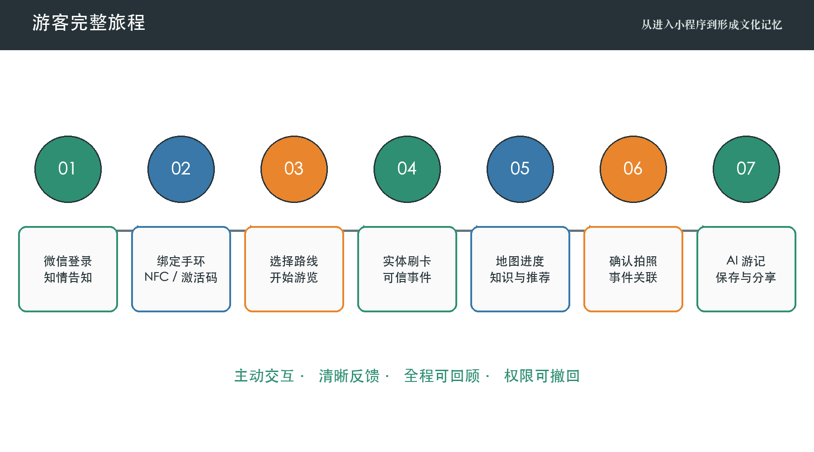
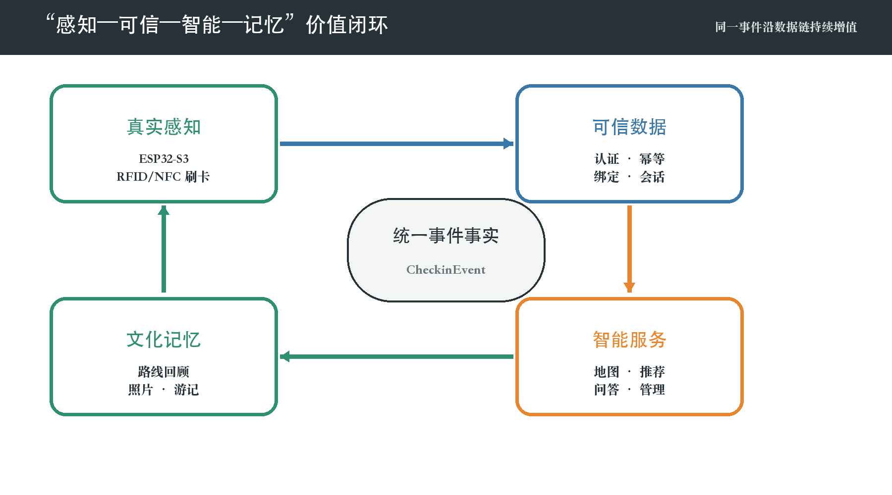
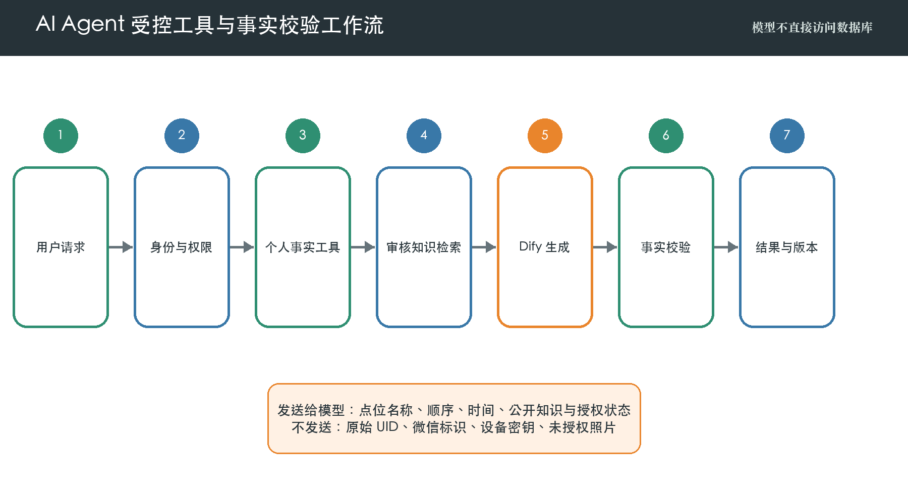
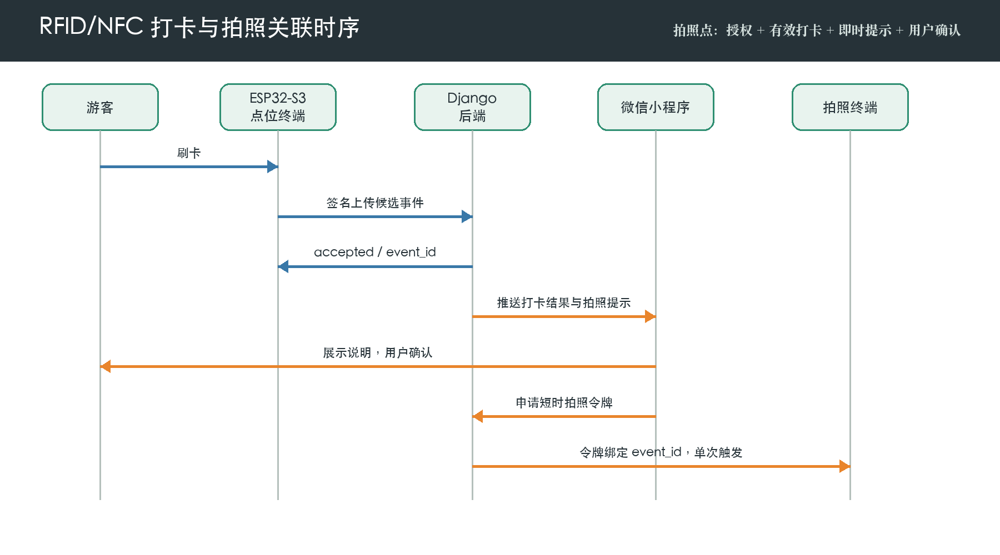
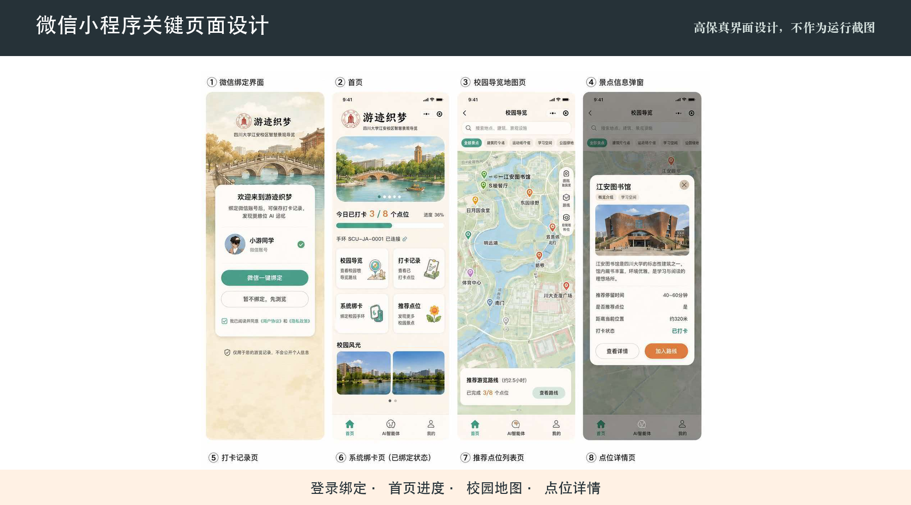
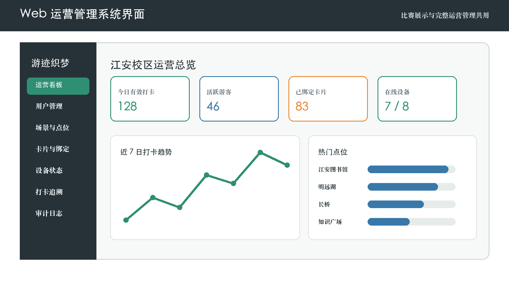
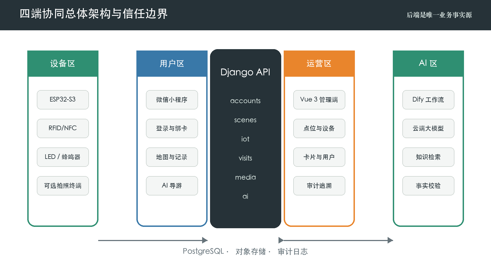
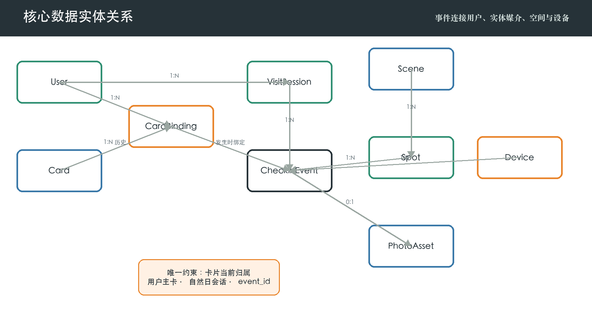

# 游迹织梦

## 摘要

“游迹织梦”是一套面向校园与文旅场景的软硬件一体化物联网感知与个性化智能服务系统。针对传统导览中“线上信息与线下游览脱节、游客行为难以形成可信记录、参观结束后缺少个性化文化记忆、运营端缺少统一数据支撑”等问题，系统以四川大学江安校区为首个验证场景，通过 ESP32-S3 点位终端、RFID/NFC 手环、微信小程序、Django 后端、Vue 3 运营管理端以及 Dify 云端大模型服务，建立“真实感知—可信数据—智能服务—文化记忆”的完整闭环。游客使用微信账号登录，可绑定多张实体卡；系统优先支持手机 NFC 读取卡片 UID，感应失败时可凭 UID 与卡面一次性激活码完成绑定。游客在点位刷卡后，终端将卡片感知结果与设备身份、点位身份、服务端时间、账号绑定和自然日游览会话融合，形成可追溯、可幂等处理的打卡事件。小程序据此展示校园地图、点位知识、路线进度、个人记录和推荐内容；部分明确标识的拍照点在游览前取得授权，并在有效打卡后经小程序再次提示、由游客确认触发拍照，照片与事件一一关联。后端是业务事实的唯一来源，Web 管理端承担场景、点位、设备、卡片、用户、路线、打卡与审计管理。AI Agent 不直接访问数据库，也不接收原始卡 UID，而是通过受控工具读取经权限过滤的游览事实和审核后的点位知识，完成问答、下一站推荐及个性化游记生成，并以生成后事实校验降低内容偏差。系统同时落实设备 HMAC-SHA256 认证、随机数防重放、JWT 用户认证、最小化采集、照片授权和操作审计。该作品以低成本实体媒介连接真实空间和数字服务，使一次校园游览能够被感知、被理解、被回顾并转化为个人文化叙事，也为景区、古镇、博物馆和乡村文旅的可配置复制提供基础。

**关键词：** 智慧文旅；ESP32-S3；RFID/NFC；微信小程序；生成式人工智能；可信数据

# 第一章 设计需求分析

## 1.1 项目背景与问题定义

### 1.1.1 传统导览的信息割裂问题

校园、景区与文博空间中的导览通常依赖地图、展牌、公众号文章或人工讲解。这些方式能够提供静态信息，却很难知道游客真正到达了哪些点位，也无法随着游览进度组织内容。游客需要在地图、介绍页、拍照应用和社交平台之间反复切换，线下体验与线上信息彼此割裂。国家《智慧旅游创新发展行动计划》提出以数字化、网络化、智能化促进旅游业深度融合，并鼓励智能感知技术进入体验空间[9]。因此，本作品关注的不只是“把地图搬进手机”，而是让真实到访成为数字服务的触发条件。

### 1.1.2 游客真实行为与数字服务脱节问题

仅依靠手机点击“我已到达”容易产生误操作，持续定位又会增加授权负担、能耗和隐私风险。游览记录若缺少设备、点位与时间等上下文，也难以支撑可靠进度、推荐和运营统计。“游迹织梦”采用近场刷卡作为明确的主动交互：游客将手环靠近点位终端，系统才产生一次候选事件，再由后端完成设备认证、卡片绑定、点位归属和事件去重。RFID/NFC 近场初始化与防冲突机制具有明确标准背景[4]，适合构建低学习成本、可感知反馈的现场入口。

### 1.1.3 江安校区文旅化体验需求

江安校区兼具湖泊、桥梁、建筑、学习空间和校园故事，点位分散且内容类型多样。新生、访客和校友的游览目的不同：有人希望快速熟悉校园，有人关注建筑和历史，有人希望获得可分享的纪念内容。系统以江安校区作为可控验证场景，将江安图书馆、明远湖、长桥等代表性点位组织为路线，通过打卡进度和知识内容把空间探索转化为连续叙事，同时让运营人员能够从数据侧理解点位热度、设备状态与路线完成情况。

## 1.2 用户与应用场景

### 1.2.1 游客使用场景

游客在小程序中完成微信登录和隐私告知，按需授权照片服务，随后绑定一张或多张手环。到达点位后刷卡，设备通过声光反馈告知读卡状态，小程序同步出现打卡结果、点位故事、路线进度和下一站建议。游览结束后，游客可以按时间顺序回顾点位、查看本人有权访问的照片，并生成基于真实路线的个性化游记。

### 1.2.2 运营人员管理场景

运营人员使用 Web 管理端查看今日打卡、活跃卡片、热门点位和设备状态，维护场景、点位、路线、媒体和知识内容；可以导入卡片、生成一次性激活码、查看绑定历史、停用异常卡片、轮换设备密钥，并沿用户、卡片、点位、设备或事件五种维度追溯数据。重要写操作记录操作者、对象、时间与原因。

### 1.2.3 比赛现场演示场景

演示以“一个账号绑定两张卡—两张卡分别打卡—小程序进度同步—拍照点确认拍摄—管理端实时追溯—AI 读取真实记录生成游记”为主线。该流程同时呈现硬件交互、数据可信、四端联通、人工智能和文旅叙事价值，避免把作品拆成互不关联的功能清单。

## 1.3 系统设计目标

### 1.3.1 真实空间感知目标

采用 ESP32-S3 作为点位终端核心主控，连接 RFID/NFC 读卡模块和声光反馈外设，通过 Wi-Fi 上传非音视频感知事件。乐鑫赛道要求使用指定 ESP 系列芯片、实现至少一种传感器数据融合、接入云端大模型，并建立设备与模型的上下行或非音视频感知数据上行链路[1]。本系统把读卡结果与设备、点位、服务端时间、卡片绑定和游览会话融合，满足“从信号到业务事实”的数据融合要求。

### 1.3.2 个性化导览目标

系统应根据游客已完成点位、当前路线、点位类别和运营推荐规则提供差异化内容。个性化不依赖持续位置追踪，而以游客主动产生的有效打卡为依据。推荐先由确定性规则筛选未完成且可用的点位，再由 AI 负责解释推荐理由，保证结果可控、可复核。

### 1.3.3 文化记忆生成目标

游览结束后，系统将真实的点位顺序、停留线索、公开知识和授权照片组织为个人游记。作品希望让“我去过哪里”进一步变成“我如何理解这段空间”，形成具有个人视角、校园文化内容和分享价值的数字记忆。

## 1.4 功能与非功能需求

### 1.4.1 用户端功能需求

用户端需提供微信登录、资料与隐私设置、多卡绑定、解绑和主卡设置；提供首页进度、地图、分类筛选、点位详情、推荐路线、打卡记录、卡片维度查询与自然日历史；提供 AI 导游问答、下一站推荐、游记生成和本人照片查看。卡片不显示“在线”，只显示可用状态、绑定状态和最近使用时间；设备才具有在线状态。

### 1.4.2 设备与运营需求

终端需完成读卡、事件封装、签名上传、结果反馈、失败重试和心跳；服务端需区分接受、重复、卡片未绑定、设备停用、点位不匹配等稳定结果。管理端需覆盖用户、卡片、激活码、绑定历史、场景、点位、媒体、路线、设备、打卡、游览会话和审计日志，并提供筛选、分页和关联详情。

### 1.4.3 安全、隐私与可靠性需求

个人信息处理遵循目的明确、公开透明和最小必要原则[8]。系统不收集与服务无关的人脸特征，不持续采集位置或影像；卡 UID、激活码、设备密钥、微信标识和模型密钥均不得出现在公开界面或知识库。设备请求必须可认证、防重放；事件处理必须幂等；用户只能访问自己的卡片、记录和照片；运营写操作必须鉴权并可审计。

# 第二章 特色与创新

## 2.1 “感知—服务—记忆”全闭环创新

### 2.1.1 从实体手环到数字游览记录

普通电子导览把手机视为唯一入口，“游迹织梦”则使用低成本实体手环连接游客与空间。手环本身不保存完整业务数据，也不承担在线通信；它只提供稳定的近场标识。每次刷卡经点位终端和后端验证后，才映射到当前账号与自然日会话。这样既保留实体互动的仪式感，也把状态管理集中在可审计的服务端。

### 2.1.2 从单次打卡到持续文旅体验

打卡不是流程终点，而是地图进度、点位知识、路线推荐、照片留念、AI 对话和游记生成的共同事实入口。一个事件同时服务用户反馈、运营统计和内容生成，使感知层产生的数据沿同一条链路持续增值。

## 2.2 可信物联网数据创新

### 2.2.1 ESP32-S3 与 RFID/NFC 点位感知

ESP32-S3 集成双核处理器、Wi-Fi、Bluetooth LE、多类外设和硬件密码能力[2]，适合连接读卡器、指示灯、蜂鸣器及可选拍照协同模块。终端采集到 UID 后不直接判定“打卡成功”，而是上传候选事件，由后端把 `device_id`、`spot_id`、`card_uid`、`event_id`、`device_time` 与可信配置融合。这一设计使物理读卡与业务事实分层。

### 2.2.2 设备认证、事件幂等与自然日游览会话

每个设备持有独立密钥，请求由时间戳、随机数、请求体摘要和设备标识组成规范串，并计算 HMAC-SHA256。HMAC 是基于共享秘密和散列函数的消息认证机制[5]。服务端校验签名、时间窗和未使用随机数后才处理事件。`event_id` 设置唯一约束，同一事件重试只返回原结果，不重复增加打卡次数。接受事件按 Asia/Shanghai 自然日归入唯一游览会话，使用户看到的“今日进度”与运营统计口径一致。

### 2.2.3 多卡绑定与实体卡一次性激活机制

一个账号可绑定多张卡，支持家庭同行、备用手环或不同主题载体；一张卡同一时间只允许存在一条有效绑定。手机 NFC 路径通过实体接触读取 UID；手输路径必须同时提交卡面一次性激活码。激活码只以密码散列保存，使用后立即失效，明文仅在生成时展示一次。解绑不删除历史关系，从而保证旧打卡仍能解释其发生时的归属。

## 2.3 受控生成式 AI 创新

### 2.3.1 真实打卡数据驱动的 Agent

Agent 不直接执行任意数据库查询，而由 Django 提供白名单工具，例如“查询本人今日进度”“列出本人打卡时间线”“获取指定点位知识”“生成候选推荐”。工具在服务端注入已认证用户，忽略模型自行提供的用户编号，从机制上避免越权。发送给模型的是点位名称、顺序、时间、公开知识和授权状态等事实快照，不包含原始 UID、微信标识或设备密钥。

### 2.3.2 规则推荐与大模型自然语言交互协同

下一站候选由规则层根据已完成点位、路线顺序、点位启用状态、类别偏好和运营权重产生；大模型只负责把候选原因组织成自然语言。这样既保留生成式交互的灵活性，又避免模型虚构不存在的点位或绕过运营规则。

### 2.3.3 带事实校验的个性化游记生成

检索增强生成把模型与外部可检索知识结合，在知识密集型任务中有助于提高内容具体性和事实性[11]。本系统将其进一步约束为三阶段：先冻结本次游览事实快照，再检索经过审核的点位知识，最后对生成结果执行点位名称、访问顺序、时间和照片引用校验。未通过校验的内容回退重写或删除不确定描述。Dify 用于编排工具、知识检索与模型节点[10]，但后端仍保留权限和业务判断权。

## 2.4 文旅叙事与应用模式创新

### 2.4.1 将游览路径转化为个人文化记忆

系统不是把所有点位介绍拼接成文章，而是以游客真实到访顺序为骨架，选择与路径相关的历史、建筑和景观知识，结合用户主动选择的叙事风格生成游记。照片仅在用户授权且确认拍摄后关联，成为可选的记忆素材。最终内容既保留事实边界，又具有个人表达。

### 2.4.2 面向多类文旅场景的可配置复制

场景、点位、分类、路线、设备与知识均由后台配置，江安校区不是写死在程序中的唯一地图。复制到古镇、景区、博物馆或乡村文旅时，可更换空间数据和内容资产，继续复用账号、卡片、事件、安全、Agent 和运营模块，降低新场景建设成本。

# 第三章 功能设计

## 3.1 系统总体业务闭环

### 3.1.1 游客完整使用流程

游客首次进入小程序后完成微信登录，阅读用户协议、隐私政策和拍照服务说明。用户可先浏览，也可绑定手环开始完整体验。绑定成功后选择推荐路线或自由游览；每次有效刷卡更新首页、地图、记录和路线进度。到达普通点位时直接返回内容，到达拍照点时先显示拍摄提示，确认后才请求拍照。游览结束后，用户选择文风和篇幅，系统生成可预览、保存和分享的游记。

### 3.1.2 运营管理流程

运营人员先创建场景和点位，配置分类、坐标、介绍、知识内容、是否可打卡及是否为拍照点，再创建路线并绑定设备。卡片通过批量导入进入库存，激活码按需生成。运营期间看板聚合今日数据；异常时可从事件下钻到设备、点位、卡片、绑定和用户，并通过审计日志还原管理操作。

## 3.2 ESP32-S3 点位终端

### 3.2.1 手环识别与事件生成

读卡器轮询进入射频场的卡片，完成读取后统一规范化 UID，生成全局唯一 `event_id`，记录设备侧时间和点位配置。设备不缓存用户姓名等业务信息，也不在本地判断卡片归属。

### 3.2.2 网络上传与现场反馈

终端通过 Wi-Fi 调用 `/api/v1/iot/checkins`，在请求头中携带设备标识、时间戳、随机数和签名。服务器响应稳定结果码，设备用绿灯和短提示音表示接受或重复，用红灯和不同节奏表示无效卡、设备禁用或网络失败。心跳接口 `/api/v1/iot/heartbeat` 更新设备最后在线时间和基础状态。

### 3.2.3 摄像头拍照点与打卡事件关联

拍照点在现场和小程序中显著标识。用户在整个游览开始前可同意或拒绝照片服务；拒绝不影响普通打卡。有效打卡后，小程序显示即时提示，用户确认才调用后端申请短时拍照令牌。令牌绑定 `user_id`、`event_id`、`device_id`、用途和过期时间，拍照终端校验后单次触发。照片上传至媒体服务并记录授权版本、创建时间和事件关联。摄像头不能脱离有效事件独立拍摄，系统不做人脸识别和持续录像，照片默认不发送给大模型。

### 3.2.4 异常重传与离线容错

网络短时中断时，终端保留最小事件队列并使用相同 `event_id` 重试；后端幂等返回避免重复。队列只保存上报所需字段并设置容量和过期策略。无法确认结果时设备提示“待同步”而非虚假成功。时钟偏差、密钥失效和设备停用均产生明确错误，便于现场排查。

## 3.3 微信小程序

### 3.3.1 微信登录与卡片绑定

小程序把微信临时登录凭证发送给后端换取系统令牌，不保存服务端密钥。绑卡页提供 NFC 感应和手动输入两种方式，手动方式额外要求一次性激活码。卡片列表支持别名、主卡、最近使用时间、按卡查看记录和解绑确认。

### 3.3.2 首页、地图与点位详情

首页展示今日已打卡数、总点位数、完成度、当前绑定卡和关键入口。地图按照建筑、学习空间、湖畔景观等分类展示点位，并区分已完成、未完成和不可用状态。点位详情包含图片、故事、建议停留时间、路线关系和打卡状态；未取得定位权限时不伪造“距当前位置”，只显示配置距离或距最近有效打卡点的参考距离并注明依据。

### 3.3.3 打卡记录、照片与路线

记录页按自然日和卡片筛选，展示时间、点位、事件类型与状态；路线页只用每个点位的首次有效事件计算完成进度，重复刷卡仍可查询但不重复计数。照片页仅展示本人且授权状态有效的媒体，可查看、下载或申请删除。

### 3.3.4 AI 导游、推荐与游记

AI 对话页提供知识问答、下一站推荐和生成游记快捷入口。回答中区分“你的游览事实”和“点位公开知识”；无依据时明确说明。游记生成页展示事实提取、知识检索、正文生成和事实校验阶段，完成后允许用户编辑标题、选择封面和保存版本。

## 3.4 后端业务服务

### 3.4.1 用户、卡片与设备管理

`accounts` 模块管理微信用户、卡片、一次性激活码和绑定历史；`iot` 模块管理设备、点位归属、密钥摘要、在线状态和随机数。绑卡、解绑、设置主卡、生成激活码和轮换设备密钥均通过事务保证约束一致。

### 3.4.2 打卡验证、会话与进度计算

`visits` 模块按“认证设备—校验点位—校验卡片及绑定—取得自然日会话—写入事件—更新统计”的顺序处理。接受事件是用户路线、完成度、推荐和 Agent 的唯一事实来源；被拒绝事件保留必要的诊断状态，但不进入用户成果。

### 3.4.3 场景、点位与路线服务

`scenes` 模块提供场景详情、点位列表与详情、路线列表与路线停靠顺序。点位下线采用状态变更而非直接删除，保证历史事件仍可解释；公开内容与 Agent 知识内容分别维护，发布前由运营人员审核。

## 3.5 Web 运营管理系统

### 3.5.1 运营数据看板

看板展示接受事件数、活跃用户、已绑定卡片、设备在线状态、打卡趋势、点位排行和最近事件。指标均可下钻到明细，避免只展示无法核对的动画数字。

### 3.5.2 点位、设备与卡片管理

点位管理支持发布、停用、媒体排序和统计；设备管理支持点位绑定、启停、心跳查看和密钥轮换；卡片管理支持批量导入预览、确认、状态更新、一次性激活码生成与绑定历史查看。密钥和激活码明文只显示一次。

### 3.5.3 用户、打卡与审计追溯

用户详情汇总其卡片、自然日游览和打卡记录；事件详情展示结果、失败原因和所有关联对象。管理员强制解绑、停用点位、轮换密钥等操作必须填写原因并写入不可由普通接口修改的审计日志。

## 3.6 AI 智能服务

### 3.6.1 点位知识问答

问答服务先识别用户问题涉及的场景或点位，再检索发布状态有效的知识段落。回答保留知识来源标识，不把用户私人事实写回公共知识库。

### 3.6.2 下一站推荐

工具层计算未完成点位、路线后继点、运营权重和类别偏好，返回最多三个候选及结构化理由。模型仅在候选范围内生成自然语言，不能创建不存在的点位。

### 3.6.3 个性化游记生成

生成输入由自然日会话、首次有效打卡时间线、点位知识摘要、用户选择的文风与经授权的照片引用组成。结果以版本保存，并记录事实快照摘要和工作流版本，便于重现。用户可删除游记或撤回照片授权，撤回后新生成内容不再引用相应媒体。

# 第四章 系统实现

## 4.1 系统总体技术架构

### 4.1.1 四端协同架构

系统采用“设备端 + Django 后端 + 微信小程序 + Web 管理端”的四端架构，并由后端统一接入 Dify 和云端大模型。设备端只调用设备 API；小程序只调用个人与公开内容 API；管理端只调用 `/management/` 接口；Dify 只调用受控 Agent 工具。数据库不直接暴露给任何前端或设备。

### 4.1.2 系统数据流与信任边界

设备区、用户区、运营区和 AI 区分别建立信任边界。设备请求用 HMAC 认证，用户和管理员使用不同权限的 JWT，AI 工具使用服务器间凭据并再次执行用户范围校验。核心数据流为“读卡候选事件—认证与融合—接受事件—个人/运营查询—脱敏事实快照—模型生成—事实校验—结果回传”。

## 4.2 硬件终端实现

### 4.2.1 ESP32-S3 主控设计

点位终端以 ESP32-S3 开发板或相应模组为核心。其双核 240 MHz 处理器、Wi-Fi/Bluetooth LE、丰富 GPIO、SPI/I2C/UART 和 HMAC 等硬件能力能够覆盖读卡、状态反馈、联网与安全需求[2]。固件按驱动层、事件层、网络层、认证层和反馈层拆分，便于从 Arduino 演示实现迁移到 ESP-IDF；乐鑫官方文档为外设、网络与安全模块提供实现依据[3]。

### 4.2.2 RFID/NFC 读卡模块与外围反馈

读卡模块通过 SPI 或 I2C 与主控连接，固件对 UID 做字节序和表示格式归一化。LED、蜂鸣器分别表达处理中、成功、重复、业务拒绝和网络失败。电源设计预留滤波与稳定供电，读卡天线与金属结构保持合理间距，外壳在刷卡区域给出清晰视觉提示。

### 4.2.3 摄像头拍照终端协同

摄像头可与点位终端组成一体机，也可作为受控从属设备。二者不通过“检测到人”自动启动，而由后端签发的一次性拍摄令牌协调。终端完成单次拍摄和上传后即使令牌失效；媒体服务回写 `photo_id` 与 `event_id`。AI 上行链路使用的是非音视频打卡事实，照片仅作为用户授权的留念资源，默认不进入模型。

### 4.2.4 设备事件协议

事件请求包含 `event_id`、`spot_id`、规范化 `card_uid`、`checkin_type` 和 `device_time`。请求头包含设备标识、时间戳、随机数和签名。服务端响应 `accepted`、`duplicate` 或稳定拒绝码及设备可显示的短消息，不返回用户姓名、头像或账号标识。

## 4.3 软件系统实现

### 4.3.1 Django 模块化单体后端

后端采用 Django 与 Django REST Framework 构建模块化单体：`accounts`、`scenes`、`iot`、`visits`、`media`、`ai` 和 `common` 分别承载领域职责。模块化单体降低比赛阶段部署和事务复杂度，同时保留清晰服务边界。PostgreSQL 保存关系数据，媒体文件通过对象存储或受控文件服务管理。OpenAPI 文档用于前后端联调。

### 4.3.2 uni-app 微信小程序

小程序采用 uni-app 组织页面和请求层，路由覆盖登录绑定、首页、地图、点位、记录、卡片、AI 与个人中心。网络层统一处理令牌刷新、错误码和加载状态；业务页面不直接拼装权限规则。涉及 NFC 和隐私权限时提供能力检测、失败原因与手动回退。

### 4.3.3 Vue 3 Web 管理端

管理端采用 Vue 3、TypeScript、Vite、Pinia、Vue Router 和组件库实现。页面按看板、用户、场景、点位、卡片、设备、路线、游览、打卡和审计划分，所有列表保持统一筛选、分页、空状态、错误状态和详情抽屉。登录态与角色权限由路由守卫和后端双重校验。

## 4.4 数据库与业务约束

### 4.4.1 核心实体关系

核心实体包括 `User`、`Card`、`CardActivationCode`、`CardBinding`、`Scene`、`Spot`、`SpotMedia`、`Route`、`RouteSpot`、`Device`、`DeviceRequestNonce`、`VisitSession`、`CheckinEvent`、`PhotoAsset`、`AiGeneration` 和 `AuditLog`。它们以事件为中心连接用户、卡片、设备、点位和会话。

### 4.4.2 卡片绑定与游览会话约束

数据库通过条件唯一约束保证每张卡最多一条有效绑定、每个用户最多一张主卡；服务事务负责在解绑主卡时提升另一张有效卡。`VisitSession` 对用户、场景和本地日期唯一，使不同卡片的接受事件可以汇入同一账号的当天旅程。

### 4.4.3 打卡事件追溯链

`CheckinEvent` 保存事件标识、处理状态、拒绝原因以及事件发生时的用户、卡片、绑定、设备、点位和会话引用。相关历史对象采用保护或软删除策略，不因后续解绑、停用或内容更新而丢失。HTTP 标准定义了方法的幂等语义[7]，本系统进一步以唯一 `event_id` 和事务处理保证业务幂等。

## 4.5 通信与安全实现

### 4.5.1 设备 HMAC-SHA256 认证

设备密钥按设备独立生成，数据库只保存受保护值，创建或轮换时明文仅显示一次。服务端对请求方法、路径、时间戳、随机数和请求体摘要构造规范串，使用恒定时间比较签名。时间窗限制陈旧请求，随机数唯一约束阻止时间窗内重放。

### 4.5.2 JWT、角色权限与操作审计

小程序通过短期访问令牌和可轮换刷新令牌访问 API；管理端账号区分只读运营者与管理员。JWT 可紧凑表达受保护声明，但隐私敏感信息应尽量不写入未加密令牌[6]，因此令牌只携带必要主体、角色、签发和过期信息。后端对对象范围再次授权，关键管理操作记录审计。

### 4.5.3 UID、激活码与设备密钥保护

UID 在业务展示中遮罩，仅必要服务可读取；激活码用单向密码散列保存并限次使用；设备密钥和 Dify/API 密钥通过环境变量或密钥管理服务注入，不写入代码仓库。日志过滤认证头、原始 UID、激活码和请求密钥，导出数据默认脱敏。

## 4.6 AI Agent 实现

### 4.6.1 Dify 与云端大模型接入

Django 以服务端凭据调用 Dify 工作流，传入会话标识、任务类型和最小事实上下文。Dify 连接至少一个云端大模型，负责意图识别、知识检索、工具编排和文本生成。模型异常、超时或额度不足时，系统降级为规则推荐和结构化记录展示，不影响基础打卡闭环。

### 4.6.2 受控工具调用链

工具包括 `get_my_current_visit`、`get_my_checkin_progress`、`list_my_checkins`、`get_spot_knowledge` 和 `get_recommendation_candidates`。调用方不可传入任意用户 ID；服务端从已认证上下文确定主体，验证场景、字段范围和调用频率，返回结构化且脱敏的数据。

### 4.6.3 游记生成与事实校验工作流

工作流冻结事实快照并计算哈希，检索点位知识，构造受约束提示词，生成草稿，再抽取草稿中的点位、顺序、时间和照片引用与快照比对。存在未知点位、顺序冲突或未授权媒体时，工作流自动删除或重写相应句子。最终保存生成版本、模型、工作流版本、事实快照摘要和校验结果。

## 4.7 系统部署与接口联通

### 4.7.1 本地及演示环境

演示环境由 Django API、PostgreSQL、Vue 管理端和小程序组成，环境变量区分开发与演示配置。初始化命令可生成江安校区的 8 个示例点位、2 条路线、3 张卡和设备数据，团队测试账号放在规范文档中，生产凭据不进入仓库。

### 4.7.2 四端接口协作

主要用户接口包括 `/auth/wechat/login`、`/me/cards`、`/scenes/{slug}`、`/spots/{id}`、`/routes/{id}`、`/me/visits/today` 和 `/me/checkins`；设备接口包括 `/iot/heartbeat` 与 `/iot/checkins`；管理接口覆盖 dashboard、users、scenes、spots、cards、devices、routes、visits、checkins 与 audit-logs。所有接口使用统一成功体、错误码、分页和时间格式。

### 4.7.3 异常处理机制

设备断网采用同事件重试，API 超时采用有限指数退避；重复事件返回原结果；数据库约束冲突转换为稳定业务错误；模型不可用时执行降级；媒体上传失败时不影响打卡接受状态，并允许用户重试拍照请求。前端对未授权、无数据、网络异常和服务降级给出可理解提示。

# 第五章 其他内容

## 5.1 系统测试与结果分析

### 5.1.1 功能与接口测试

后端自动化测试覆盖多卡绑定、一次性激活码消费、主卡切换、用户数据隔离、场景与路线查询、管理写权限、审计日志和接口错误码。前端通过构建检查和关键页面操作验证登录、列表、筛选、详情与状态反馈。完整接口契约以 OpenAPI 文档为准，联调结果与预期业务规则一致。

### 5.1.2 设备打卡与幂等测试

设备测试覆盖有效签名、错误签名、过期时间戳、随机数重放、未绑定卡、停用卡、点位不匹配和重复 `event_id`。同一事件多次上传只形成一条业务记录，两张属于同一账号的卡可在同一自然日会话中分别打卡，进度按不同点位计算。

### 5.1.3 完整演示闭环测试

闭环验收从绑定两张卡开始，依次验证刷卡、进度、记录、管理端追溯、AI 查询和游记生成。拍照服务单独覆盖五类场景：未授权时拒绝、非拍照点拒绝、无有效打卡拒绝、提示后用户取消不拍摄、确认后照片正确关联唯一事件。测试坚持“失败时不拍、取消时不拍、成功时可追溯”。

| 测试类别 | 关键输入 | 预期与验收结果 |
|---|---|---|
| 多卡绑定 | 同账号两张不同卡 | 均可绑定，只有一张主卡 |
| 卡片唯一归属 | 已绑定卡再次绑定其他账号 | 拒绝且不改变原关系 |
| 打卡幂等 | 相同 event_id 重复提交 | 返回重复结果，仅一条事实记录 |
| 权限隔离 | 查询其他用户记录 | 拒绝访问 |
| 拍照授权 | 未授权或用户取消 | 不触发摄像头 |
| 照片关联 | 授权且确认的有效拍照点事件 | 照片关联唯一 event_id |
| AI 事实边界 | 提问不存在的已访问点位 | 不虚构到访事实 |
| 服务降级 | 云端模型不可用 | 保留打卡、地图和规则推荐 |

## 5.2 成本与工程可行性

### 5.2.1 点位终端成本构成

样机终端主要由 ESP32-S3 开发板或模组、RFID/NFC 读卡模块、指示灯/蜂鸣器、电源、外壳与连接件组成；拍照点额外配置摄像头及存储/上传能力。采用通用器件和标准接口可以在演示阶段快速装配，量产时再通过自制 PCB、结构优化和批量采购降低成本。

| 构成 | 普通打卡点 | 拍照打卡点 | 成本控制策略 |
|---|---|---|---|
| 主控与联网 | ESP32-S3 | ESP32-S3 | 统一主控与固件基线 |
| 近场感知 | RFID/NFC 读卡模块 | RFID/NFC 读卡模块 | 共用驱动与协议 |
| 反馈 | LED、蜂鸣器 | LED、蜂鸣器 | 低成本标准外设 |
| 影像 | 无 | 摄像头与媒体上传 | 仅在特色点位配置 |
| 结构供电 | 外壳、电源、连接件 | 强化外壳、电源、连接件 | 模块化维护与替换 |

### 5.2.2 软件部署与维护成本

Django 模块化单体减少早期微服务运维成本；PostgreSQL、Vue、uni-app 与 Dify 均有成熟工具链。场景内容和路线由后台配置，新场景无需复制核心代码。设备心跳、审计、批量导入和稳定错误码降低日常维护与现场排错成本。

## 5.3 隐私保护与社会责任

### 5.3.1 最小化数据采集

系统只收集完成登录、绑卡、打卡、照片和智能服务所需的数据，不因推荐而持续采集精确位置。用户事实与公共知识分库存储，AI 只读取当前任务所需字段。账号注销、解绑、撤回照片授权和删除游记均提供明确入口；统计展示优先使用聚合和脱敏结果。

### 5.3.2 照片授权与个人数据保护

拍照服务在游览开始前说明目的、范围、保存与访问方式，用户可拒绝且不影响普通功能；现场打卡后再次提示，确认才触发。照片访问使用对象级权限和短时地址，运营人员非因处理需要不得查看。系统不做人脸识别、不持续录像、不以照片推断身份或行为；授权撤回后停止新的处理并按规则删除或隔离媒体。

## 5.4 应用价值与发展前景

### 5.4.1 校园文化传播价值

作品把分散的建筑、景观与故事连接成可亲自探索的路线，让新生和访客通过实体互动建立空间记忆；校友重游时可形成具有个人路径的纪念内容。管理端的数据也能帮助校园文化运营者优化点位内容和路线组织。

### 5.4.2 景区、古镇与乡村文旅推广价值

在景区和古镇中，系统可把历史建筑、非遗工坊、自然景观和公共服务点组织成主题路线；在乡村文旅中，可通过低成本手环和分布式终端串联较为分散的资源。智慧旅游政策鼓励线上线下融合、智能感知与数字内容新场景[9]，本作品提供了从感知到叙事的可落地参考。

### 5.4.3 标准化场景复制能力

系统以 `Scene` 为租户式边界，点位、路线、设备、知识和媒体均配置化；设备协议和 API 保持稳定。未来复制时主要替换内容、地图与终端布局，并根据当地规则调整隐私告知与运营角色，而不改变可信事件和受控 AI 的核心机制。

# 第六章 参考文献

[1] 全国大学生物联网设计竞赛组委会, 乐鑫科技. 2026年全国大学生物联网设计竞赛命题——乐鑫科技赛道[EB/OL]. (2026-03-29)[2026-07-22]. https://iot.sjtu.edu.cn/ueditor/net/upload/file/20260329/6391039317778793056390288.pdf.

[2] ESPRESSIF SYSTEMS. ESP32-S3 Series Datasheet: Version 2.2[EB/OL]. [2026-07-22]. https://www.espressif.com/sites/default/files/documentation/esp32-s3_datasheet_en.pdf.

[3] ESPRESSIF SYSTEMS. ESP-IDF Programming Guide: ESP32-S3[EB/OL]. [2026-07-22]. https://docs.espressif.com/projects/esp-idf/en/latest/esp32s3/.

[4] ISO/IEC. ISO/IEC 14443-3:2018 Cards and security devices for personal identification—Contactless proximity objects—Part 3: Initialization and anticollision[S]. Geneva: International Organization for Standardization, 2018.

[5] NATIONAL INSTITUTE OF STANDARDS AND TECHNOLOGY. FIPS PUB 198-1: The Keyed-Hash Message Authentication Code (HMAC)[S]. Gaithersburg: NIST, 2008.

[6] JONES M, BRADLEY J, SAKIMURA N. RFC 7519: JSON Web Token (JWT)[S]. Internet Engineering Task Force, 2015.

[7] FIELDING R, NOTTINGHAM M, RESCHKE J. RFC 9110: HTTP Semantics[S]. Internet Engineering Task Force, 2022.

[8] 全国人民代表大会常务委员会. 中华人民共和国个人信息保护法[Z]. 2021-08-20.

[9] 文化和旅游部办公厅, 中央网信办秘书局, 国家发展改革委办公厅, 等. 智慧旅游创新发展行动计划: 办资源发〔2024〕82号[Z]. 2024-05-06.

[10] DIFY. Knowledge Retrieval Documentation[EB/OL]. [2026-07-22]. https://docs.dify.ai/guides/knowledge-base/retrieval.

[11] LEWIS P, PEREZ E, PIKTUS A, et al. Retrieval-Augmented Generation for Knowledge-Intensive NLP Tasks[C]//Advances in Neural Information Processing Systems 33. 2020: 9459-9474.
