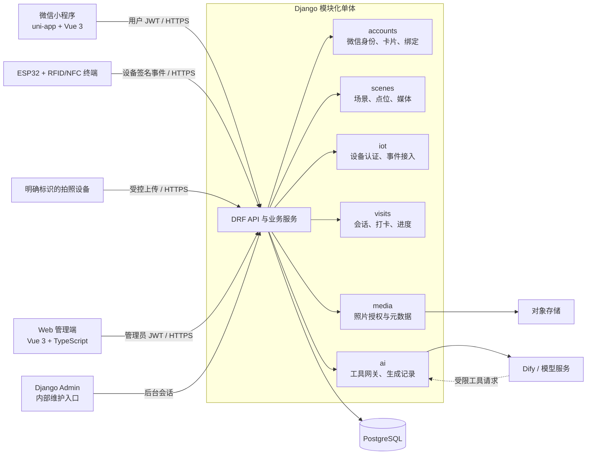
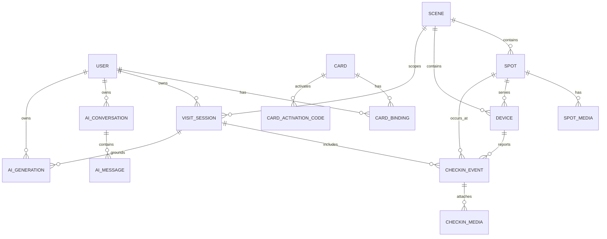

# 游迹织梦：江安校区最终参赛版技术架构与数据设计

> 文档状态：草案 v0.2（已加入四端架构，供团队评审）
> 适用范围：四川大学江安校区最终参赛系统（初赛交付）
> 依赖文档：[产品与业务规则设计](2026-07-13-jiang-an-mvp-product-business-design.md)（已确认）
> 技术栈决策：Django + Django REST Framework + PostgreSQL + Vue 3 Web 管理端 + Django Admin

## 1. 架构目标与不可违反的约束

本架构服务于一条可稳定演示的闭环：游客登录并绑定手环，在真实点位刷卡，后端形成可信打卡事实，小程序展示个人游览状态，AI 只能依据这些事实进行问答、推荐和内容生成。

项目包含四个正式运行端：Django 后端、独立 Web 管理端、微信小程序和 ESP32 Arduino 设备端。Django Admin 是后端内部维护入口，不计为独立业务端。

系统必须满足以下约束：

- 采用模块化单体，不拆分微服务；所有正式业务 API 和管理后台由同一个 Django 项目提供。
- 后端是用户、卡片、设备、点位、打卡、照片和 AI 内容的唯一可信来源。
- 微信小程序、Web 管理端、ESP32/RFID 设备、摄像头和 Dify/模型服务均不得直接访问数据库。
- v2 开发环境与正式环境均使用 PostgreSQL；旧 FastAPI + SQLite 原型仅保留参考，不作为 v2 依赖。
- 江安校区是首个 `Scene` 数据，不是代码中的固定场景；所有业务实体通过 `scene` 关联场景。
- 同一用户在同一 `Scene`、同一中国标准时间自然日只有一个游览会话。
- 原始卡 UID、设备凭据、微信密钥、Dify/模型密钥不写入前端代码、日志或管理页面的普通列表。

## 2. 选型与职责

| 层级 | 选型 | 职责 | 本次不承担的职责 |
|---|---|---|---|
| 小程序 | uni-app + Vue 3 + TypeScript | 登录、导览、展示个人数据、触发 AI 对话 | 业务判定、数据库访问、保存服务密钥 |
| 后端 | Python 3.12、Django、Django REST Framework | 身份、权限、业务规则、REST API、管理后台、AI/对象存储代理 | 多服务编排、跨场景运营平台 |
| 数据库 | PostgreSQL | 关系数据、约束、事务、审计数据 | 直接存储图片文件 |
| Web 管理端 | Vue 3 + TypeScript + Vite | 比赛展示看板、日常运营管理、权限内的数据维护 | 直接访问数据库、保存后端密钥 |
| 内部维护后台 | Django Admin | 系统账号、异常数据和故障兜底维护 | 比赛主展示、日常主要运营界面 |
| 硬件 | ESP32 + Arduino Framework + RFID/NFC 读卡模块 | 读卡、生成事件、受认证地上传、现场反馈 | 身份映射、路线、推荐、AI |
| 媒体 | 腾讯云 COS 或兼容对象存储 | 点位图、打卡照片的受控文件存储 | 业务权限判定 |
| AI | Dify 工作流/Agent + 已选大模型服务 | 对话编排、受控工具调用、内容生成 | 用户鉴权、事实来源、直接数据库访问 |

Python 3.12 是 v2 的统一运行时版本；开发、测试、部署必须保持一致。Django、DRF、数据库驱动和外部 SDK 的精确版本应锁定在依赖文件中，升级须经过测试后单独提交。

## 3. 总体架构



### 3.1 模块边界

| Django App | 负责 | 公开给其他模块的能力 | 不负责 |
|---|---|---|---|
| `common` | 时间、ID、错误码、审计、通用权限与工具函数 | 统一响应、分页、异常、时间处理 | 具体业务规则 |
| `accounts` | 微信身份、`User`、卡片、激活码、历史绑定 | 当前用户、有效卡片绑定、卡 UID 安全查找 | 点位与打卡处理 |
| `scenes` | `Scene`、`Spot`、`SpotMedia`、点位标签和地图坐标 | 场景/点位的公开资料、点位可打卡性 | 用户个人状态 |
| `iot` | `Device`、设备凭据、设备签名验证、事件入口 | 已认证的设备请求上下文 | 用户身份映射与会话计算 |
| `visits` | `VisitSession`、`CheckinEvent`、进度与路线查询 | 创建/查询自然日会话、处理有效打卡 | AI 文本生成、图片文件存储 |
| `media` | `CheckinMedia`、照片上传授权、访问授权 | 针对有效事件的照片关联与有权访问 URL | 摄像头人脸识别或轨迹推断 |
| `ai` | `AIConversation`、`AIMessage`、`AIGeneration`、工具网关 | 面向当前用户的受控工具和生成工作流 | 直接查询任意模型或任意用户数据 |

跨模块调用使用应用服务或明确的查询函数；不得为了方便在任意 View 中直接拼接多张业务表，更不得将 AI 或设备逻辑写进小程序。

## 4. 代码组织与运行边界

最终仓库建议采用单仓库、按运行端顶层分隔的结构：

```text
IOT/
├── backend/                 # Django 项目与后端测试
│   ├── config/              # settings、URL、ASGI/WSGI
│   ├── apps/
│   │   ├── common/
│   │   ├── accounts/
│   │   ├── scenes/
│   │   ├── iot/
│   │   ├── visits/
│   │   ├── media/
│   │   └── ai/
│   ├── requirements/        # 锁定的运行与开发依赖
│   ├── tests/               # 跨模块 API、权限与端到端测试
│   └── manage.py
├── miniprogram/             # uni-app 小程序
│   ├── src/pages/
│   ├── src/services/        # 仅封装后端 API 调用
│   ├── src/stores/
│   └── src/types/
├── admin-web/               # Vue 3 展示与运营管理端
│   ├── src/views/
│   ├── src/services/        # 管理 API 调用
│   ├── src/stores/
│   ├── src/router/
│   └── src/types/
├── firmware/                # ESP32 Arduino 固件与设备配置说明
├── infra/                   # Docker、环境变量示例、部署说明
└── docs/                    # 产品、技术、接口和验收文档
```

`backend/` 是唯一可以访问数据库迁移、对象存储密钥、设备凭据和 AI 密钥的位置。`miniprogram/` 只持有后端 API 地址和用户会话令牌；`admin-web/` 只持有管理 API 地址和管理员会话令牌；`firmware/` 只持有本设备的可轮换设备凭据。

## 5. 身份、鉴权与权限模型

### 5.1 游客身份

1. 小程序取得微信登录临时 `code`，仅将该 `code` 发送给后端。
2. 后端调用微信服务完成身份交换，按平台稳定用户标识创建或查找 `User`。
3. 后端签发短期访问令牌和可轮换刷新令牌；小程序之后仅携带后端令牌访问 API。
4. 小程序昵称、头像属于展示资料，不得被作为用户主键或权限凭据。

所有面向游客的资源均按当前认证 `User` 过滤。用户只能读取自己的卡片状态、游览、照片、对话与生成内容。

### 5.2 管理员身份

管理员通过独立 Web 管理端进行日常展示和运营；Django Admin 仅供系统管理员内部维护。两者共用 Django 的管理员身份与最小权限组，至少分为：

- 内容运营：维护 Scene、Spot、SpotMedia、标签和公开知识内容；
- 设备运营：维护 Device、设备启停和设备归属；
- 受控数据管理员：处理卡片激活码、异常绑定和必要的打卡纠错；
- 系统管理员：管理后台账号、环境与权限。

普通运营人员不可查看完整卡 UID、原始设备密钥或其他用户的对话正文。

### 5.3 设备身份

每台设备配置唯一 `device_id` 和可轮换设备密钥。设备请求使用 HTTPS，并在请求头中提供设备标识、时间戳、随机数和基于请求体摘要的 HMAC 签名。后端校验签名、时间窗、随机数重放和设备启用状态后，才接受事件。

建议签名输入按以下稳定顺序构造：

```text
METHOD + "\n" + PATH + "\n" + TIMESTAMP + "\n" + NONCE + "\n" + SHA256(raw_body)
```

服务端需要使用设备密钥重新计算 HMAC-SHA256，因此设备密钥须以受环境主密钥保护的加密形式保存，而不能只存不可逆哈希；后台显示时仅显示密钥指纹或最后四位。明文密钥只在设备首次配网或轮换时安全发放，具体 Header 名称和错误码由接口契约固定。

### 5.4 服务间身份

后端调用 Dify 时使用仅存在于后端环境变量中的服务凭据。Dify 如需调用后端工具，使用后端签发、短时有效、限定用户与会话范围的服务令牌；绝不转发游客 JWT 或数据库凭据。

## 6. 核心数据模型

### 6.1 实体关系



### 6.2 主要表与关键字段

| 实体 | 必要字段 | 关键约束/索引 |
|---|---|---|
| `User` | `id`、`wechat_openid`、展示资料、`created_at` | 微信稳定标识唯一；不以昵称作唯一值 |
| `Card` | `id`、`uid_hmac`、`uid_masked`、`status`、`issued_at` | `uid_hmac` 唯一；不保存可直接展示的完整 UID |
| `CardActivationCode` | `id`、`card`、`code_hash`、`issued_at`、`used_at`、`revoked_at` | 每次码只能成功使用一次；明文码不入库 |
| `CardBinding` | `id`、`user`、`card`、`is_primary`、`bound_at`、`unbound_at`、`reason` | PostgreSQL 条件唯一约束：一张卡最多一条未解绑记录；一个用户最多一张主要卡，但可有多张有效卡 |
| `Scene` | `id`、`slug`、`name`、`status`、`timezone` | `slug` 唯一；本次数据为江安校区 |
| `Spot` | `id`、`scene`、`name`、`slug`、`type`、`map_x`、`map_y`、`is_checkin_enabled`、`is_photo_spot`、`tags`、`suggested_stay_minutes` | `scene + slug` 唯一；坐标为相对地图比例坐标 |
| `SpotMedia` | `id`、`spot`、`storage_key`、`media_type`、`caption`、`sort_order` | 仅存对象键和元数据；公开性由业务字段控制 |
| `Device` | `id`、`device_id`、`scene`、`spot`、`secret_encrypted`、`secret_fingerprint`、`status`、`last_seen_at` | `device_id` 唯一；设备必须关联已启用 Spot |
| `VisitSession` | `id`、`user`、`scene`、`local_date`、`started_at`、`last_checkin_at` | `user + scene + local_date` 唯一；日期按 `Asia/Shanghai` 计算 |
| `CheckinEvent` | `id`、`device`、`spot`、`session`、`card_binding`（可空）、`card`（可空）、`card_uid_hmac`、`event_id`、`checkin_type`、`device_time`、`received_at`、`status`、`failure_code` | `device + event_id` 唯一；accepted 事件保存当时有效绑定，任何重复上报返回首个处理结果 |
| `CheckinMedia` | `id`、`checkin_event`、`storage_key`、`captured_at`、`consent_version`、`status` | 必须关联有效且属于拍照点的打卡事件 |
| `AIConversation` | `id`、`user`、`scene`（可空）、`created_at`、`last_active_at` | 仅所有者可读写 |
| `AIMessage` | `id`、`conversation`、`role`、`content`、`tool_trace`、`created_at` | `role` 仅 user/assistant/system；工具轨迹不直接暴露敏感信息 |
| `AIGeneration` | `id`、`user`、`session`、`generation_type`、`source_snapshot`、`status`、`content`、`model_version`、`created_at` | 生成内容必须保留受控事实快照和状态 |

### 6.3 数据完整性要求

- `CardBinding` 必须由 PostgreSQL 条件唯一约束保证“一张卡同一时刻只属于一个用户”和“一个用户最多一张主要卡”；用户的有效卡片数量不设为一。
- `VisitSession` 使用 `local_date` 实现“自然日一个会话”；后端以 `Asia/Shanghai` 生成该日期，不能使用设备时间。
- `CheckinEvent` 无论接受或拒绝，都以 `(device, event_id)` 保证幂等；首个结果是后续重试的唯一结果。
- `CheckinEvent.card` 与 `CheckinEvent.card_binding` 允许为空，以便保留未绑定或不明卡的最小审计；accepted 事件保存当时绑定关系，原始 UID 不保存，只保存服务端 HMAC 结果。
- `CheckinMedia` 的创建必须验证其事件已接受、Spot 是拍照点、调用方设备被授权；其访问必须再次验证照片所属用户。
- `AIGeneration.source_snapshot` 保存生成当时经权限过滤的路线和点位资料摘要，避免历史内容因日后点位资料修改而无法追溯。

## 7. 关键业务事务与数据流

### 7.1 卡片绑定

```text
小程序：微信登录成功
  → NFC 读取 UID；失败则输入 UID + 一次性激活码
  → 后端计算 UID HMAC 并在事务中锁定 Card
  → 检查 Card 状态、有效绑定、激活码（手输分支）
  → 创建 CardBinding，并使激活码已使用
  → 返回脱敏卡号和绑定状态
```

NFC 读取路径证明用户当时接触了实体卡；手输 UID 路径必须额外校验随卡激活码。无论哪种路径，卡片已被有效绑定时均拒绝覆盖。

### 7.2 设备打卡

```text
ESP32 读到卡 UID
  → 生成 UUID 格式 event_id
  → 以设备签名提交 device_id、spot_id、card_uid、checkin_type、event_id、device_time
  → 后端验证设备签名、重放、设备/点位关系
  → 查询 event_id：已存在则原样返回第一次处理结果
  → 在数据库事务中验证卡片有效绑定与 Scene
  → 按 Asia/Shanghai 日期取得/创建 VisitSession
  → 创建 accepted 或 rejected 的 CheckinEvent
  → 返回不会泄露用户身份的设备结果
```

当事件被接受时，进度按会话内不同 `Spot` 计算；同点后续 accepted 事件保留审计但不增加进度。后端服务接收时间用于排序和会话日期，`device_time` 仅用于排障和展示参考。

### 7.3 照片关联

```text
有效打卡发生在明确标识的拍照点
  → 后端为该 CheckinEvent 创建短时上传授权
  → 已授权拍照设备上传图片到受控对象键
  → 后端登记 CheckinMedia（含 consent_version）
  → 小程序请求个人记录
  → 后端检查 CheckinEvent 所属用户后返回短时访问 URL
```

系统不进行人脸识别，不通过摄像头创建独立游客轨迹。照片上传和访问均需经过后端；对象存储桶不得对公网永久公开写入或读取权限。

### 7.4 AI 对话、推荐与游记

```text
小程序请求 AI
  → 后端验证 User 与会话范围
  → 后端调用 Dify（服务端密钥）
  → Dify 通过短时、限权令牌调用 ai 工具网关
  → 工具网关按当前 User 返回真实路线/点位/推荐数据
  → Dify 返回文本
  → 后端进行输出约束检查，保存消息或 AIGeneration
  → 小程序显示结果
```

`generate_story_package` 不允许由 Agent 任意绕过固定步骤。后端必须先产生会话的事实快照，调用生成服务，再校验输出引用的 Spot 是否全部来自该快照及公开点位资料；检查通过后才保存结果。

## 8. API 设计原则与接口分组

所有 API 使用 HTTPS、JSON 和 `/api/v1/` 前缀。成功响应使用 `data` 包装；失败响应使用稳定错误码、用户可读消息和 `request_id`，不返回堆栈、密钥、完整 UID 或其他用户信息。

| 分组 | 路径示例 | 调用方 | 说明 |
|---|---|---|---|
| 认证 | `POST /api/v1/auth/wechat/login`、`POST /api/v1/auth/refresh` | 小程序 | 用微信临时 code 换取后端令牌 |
| 当前用户与绑卡 | `GET /api/v1/me`、`POST /api/v1/me/card-bindings`、`DELETE /api/v1/me/card-binding` | 小程序 | NFC/手输的绑定请求均在后端判定 |
| 场景与点位 | `GET /api/v1/scenes/{slug}`、`GET /api/v1/scenes/{slug}/spots`、`GET /api/v1/spots/{id}` | 小程序 | 公开资料与当前用户打卡状态分离返回 |
| 游览与记录 | `GET /api/v1/visits/today`、`GET /api/v1/visits/{id}`、`GET /api/v1/visits/history` | 小程序 | 返回当前/历史自然日会话、路线和进度 |
| 推荐 | `POST /api/v1/recommendations/next-spots` | 小程序、AI 工具 | 规则服务的可解释结果 |
| AI | `POST /api/v1/ai/conversations`、`POST /api/v1/ai/conversations/{id}/messages`、`POST /api/v1/ai/generations/story` | 小程序 | 后端鉴权、Dify 代理、结果保存 |
| 设备事件 | `POST /api/v1/iot/checkins` | RFID 设备 | 仅接受设备签名；幂等接收打卡 |
| 设备媒体 | `POST /api/v1/iot/checkins/{event_id}/media-upload` | 拍照设备 | 仅有效拍照事件可取得短时上传授权 |
| 管理 API | `/api/v1/management/*` | Web 管理端 | 按角色提供看板统计和运营管理能力 |
| 内部维护 | `/admin/` | 系统管理员 | Django Admin 故障兜底，不向小程序开放 |

接口文档将在下一份《API 与硬件事件契约》中定义每个请求/响应字段、Header、错误码、权限和示例；本文件不允许接口名称被实现时随意替换。

## 9. AI 受控工具网关

| 工具 | 输入范围 | 输出范围 | 强制限制 |
|---|---|---|---|
| `get_current_route` | 当前用户、已授权会话或“今天” | 该会话 accepted 事件的路线摘要 | 不允许任意 user/session ID |
| `get_checkin_progress` | 当前用户、会话 | 已/未打卡数与进度 | 不返回其他人的统计 |
| `get_spot_detail` | 公开 Spot ID/slug | 已发布的公开资料 | 不引用未审核运营资料 |
| `list_unvisited_spots` | 当前用户、会话 | 同 Scene 未打卡且可访问点位 | 只按 accepted 事件计算 |
| `recommend_next_spots` | 当前用户、会话、可选偏好/时间 | 规则推荐和理由 | 不伪造实时定位、距离或活动 |
| `generate_story_package` | 当前用户、会话、文体偏好 | 经过核验的游记/分享内容 | 固定流程；必须保存事实快照 |
| `get_generation_history` | 当前用户 | 所有者自己的历史内容 | 不返回其他用户内容 |

工具网关不接收模型自由拼接的 SQL、URL 或过滤条件。所有工具由后端按白名单参数解析，并在用户权限过滤后执行。

## 10. 媒体、隐私与日志

### 10.1 数据分类

| 类别 | 示例 | 保护要求 |
|---|---|---|
| 直接身份与凭据 | 微信身份标识、刷新令牌、设备密钥、激活码 | 加密传输；密钥/码只存安全散列或受控密文；不得出现在日志 |
| 准身份标识 | 卡 UID HMAC、脱敏卡号、设备 ID | 最小展示、按角色访问、日志脱敏 |
| 游览行为 | 有效打卡、会话、推荐输入 | 仅本人和获授权管理员可读；用于 AI 前先做当前用户过滤 |
| 影像 | 点位图、打卡照片 | 明示采集、事件关联、短时授权访问、对象存储私有 |
| AI 内容 | 对话、游记、分享文案与事实快照 | 仅所有者访问；生成依据可追溯 |

### 10.2 日志原则

- 每个 API 响应带 `request_id`；设备和 AI 调用链均记录该关联 ID。
- 记录事件 ID、设备 ID、状态、耗时和错误码，避免记录完整请求体中的 UID、令牌、激活码和对话敏感正文。
- 生产错误监控中的堆栈不得对小程序响应暴露。
- 数据纠错、卡片换绑、激活码重置等管理操作必须留下管理员、时间、对象和原因审计。

## 11. 环境、配置与部署

| 环境 | 目的 | 数据/服务要求 |
|---|---|---|
| 本地开发 | 功能开发、接口联调 | Docker Compose 提供 PostgreSQL；对象存储使用隔离测试桶或本地兼容服务；所有密钥在 `.env`，不提交 |
| 测试/演示 | 设备联调、演示彩排 | 独立 PostgreSQL 数据库、独立对象存储前缀、已登记测试设备与点位 |
| 正式演示部署 | 现场展示 | HTTPS、受控环境变量、数据库备份、健康检查、日志与回滚说明 |

必须提交 `.env.example`，列出变量名称但不包含真实值。至少包括：`DJANGO_SECRET_KEY`、`DATABASE_URL`、`WECHAT_APP_ID`、`WECHAT_APP_SECRET`、`DEVICE_HMAC_MASTER_KEY`、`CARD_UID_HMAC_KEY`、对象存储配置、`DIFY_API_KEY`、模型服务配置和允许的前端域名。

数据库迁移是后端代码的一部分；不允许通过手工修改生产数据库来创建表、字段或初始结构。江安校区的首批 Scene、Spot、Device 和测试卡数据应使用受版本控制的初始化命令或数据迁移导入。

## 12. 测试与验收策略

| 层级 | 重点 | 最低覆盖场景 |
|---|---|---|
| 模型/服务单元测试 | 约束、日期、事务、权限 | 一人多卡、一卡一人、主要卡唯一、激活码一次性、自然日会话、同点进度去重 |
| API 集成测试 | 认证、响应、权限与错误码 | 未登录拒绝、本人数据可读、他人数据不可读、绑卡冲突、无效卡 |
| 管理端权限测试 | 角色、敏感字段和高风险操作 | 内容运营不能管理设备密钥；设备运营不能查看用户隐私；高风险操作必须审计 |
| 设备契约测试 | HMAC、重放、幂等、点位关系 | 同一 `(device_id,event_id)` 重传不重复写入；设备不能上报其他 Spot |
| 媒体权限测试 | 事件关联与访问控制 | 非拍照点拒绝上传；非所有者拒绝查看照片 |
| AI 工具测试 | 数据范围与事实边界 | 无路线不编造；工具无法查询其他用户；游记仅引用会话快照点位 |
| 端到端演练 | 现场真实闭环 | 依产品文档第 8 节的 11 步完整走通 |

任何涉及卡片绑定、设备接入、进度计算、照片访问和 AI 路线事实的改动，必须至少包含对应自动化测试和一次演示环境回归。

## 13. 实施顺序与输入依赖

推荐按以下依赖顺序实施：

1. 工程基础、环境配置、Django 项目、PostgreSQL、基础用户与 Admin；
2. Scene/Spot/SpotMedia、测试种子数据与地图公开查询；
3. 微信登录、卡片、激活码与一人多卡绑定；
4. Device 认证、打卡事件幂等处理、自然日会话与进度；
5. Web 管理端基础、比赛展示看板和点位/设备/卡片运营功能接入真实 API；
6. 小程序首页、导览、记录和绑定页面接入真实 API；
7. 拍照事件关联、私有对象存储与照片展示；
8. 规则推荐、AI 工具网关、路线问答与游记固定工作流；
9. 后台完善、现场异常演练、部署与最终验收。

进入第 2 步前，团队需提供首批江安校区点位清单：名称、类型、地图比例坐标、简介、图片、标签、建议停留时间、是否可打卡、是否拍照点。进入第 4 步前，需完成至少一台 RFID 设备的 `device_id`、Spot 归属和事件字段联调。进入第 6 步前，需完成拍照点告知文案与设备上传方式确认。

## 14. 下一份文档

本文件确认后，下一份文档为《API 与硬件事件契约》。它将固定：

1. 游客 API、管理 API 和设备 API 的 HTTP 方法、请求体、响应体、分页和错误码；
2. 设备 HMAC Header、签名计算、时间窗、随机数和事件重传处理；
3. 卡片绑定的 NFC/手输两条请求路径；
4. 小程序、Web 管理端、摄像头和 Dify 工具网关的权限与调用示例；
5. 前后端和硬件联调可直接使用的请求样例与验收用例。

在 API 契约确认前，可以创建项目目录和基础依赖，但不得实现会自行假设接口字段、鉴权方式或设备签名格式的业务代码。
